# Welcome To Control Craft Wiki
## Blocks:
### ChunkLoader:

- 

- **Description:**
  - Placed on a VS ship, it automatically force-loads the surrounding chunks.
- **Details:**
  - It will load chunks only when it is on a VS physical structure.
  - The loading area is 5x5 chunks by default, and the radius R can be adjusted in the Config file. Since the ChunkLoader itself is located in one chunk, the actual area is a region with a side length of (1+R).
  - If the VS physical structure is unloaded, the ChunkLoader will become ineffective.

### Propeller Controller & Propeller:
- Propeller Controller:
- 
- Propeller:
- 
- Combined usage:
- 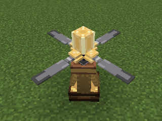
- **Description:**
  - Place the Propeller on the Propeller Controller to function. It acts as a propeller with counter-torque.
- **Propeller Controller Control Panel**
  - 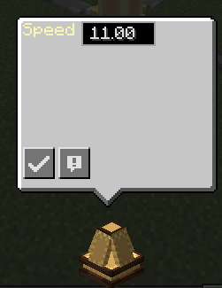
  - Speed: Input the speed to adjust the propeller's speed, with no limit by default.
- **Propeller Control Panel**
  - 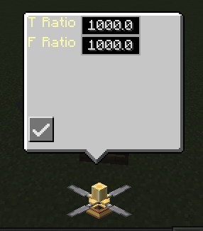
  - T Ratio: The counter-torque coefficient when the propeller rotates.
  - F Ratio: The lift coefficient of the propeller.
- **Force:**
  - Direction: When the speed, torque coefficient, and force coefficient are positive, the propeller rotates clockwise, generating counter-torque that makes the physical structure rotate counterclockwise, and the force direction is upward.
  - Magnitude: Speed multiplied by the coefficient.
- **Propeller Controller Redstone Interface**
  - 
  - Speed: When connected to a redstone signal, the speed will take values between min and max at equal intervals, with 0 being min and 15 being max.
- **Propeller Controller CC Peripheral**
- ```lua
  local p = peripheral.find("PropellerController")
  local p = 100

  p.setTargetSpeed(speed) -- Set the target speed
  local v = p.getTargetSpeed() -- Get the current speed
  ```

### Peripheral Proxy & Peripheral Interface
- Peripheral Proxy
- 
- Peripheral Interface
- 
- **Description:**
  - Attach the Proxy to a CC computer and the Interface to a CC peripheral. The Proxy can remotely call the peripheral attached to the Interface.
- **Peripheral Interface Control Panel:**

  - Not attached to a peripheral:
  - 
  - Attached to a peripheral, using Propeller Controller as an example:
  - 

  - The first row of the panel shows the peripheral ID as Type, the initial Name is null, indicating it is unnamed, and the default Channel is 0.

- **Naming**
  - The name cannot be null or empty. All peripherals in the same channel must have unique names.
  - If you try to use an already occupied name, the naming will fail, and the Name value will remain unchanged.
- **Channel**
  - You can set the Proxy's channel in the Proxy's peripheral methods. The Proxy can only call the remote peripherals connected to the Interface in the same channel.
- **Calling**
  - Example:
  - Attach the Proxy to a CC computer and the Interface to a Propeller Controller. Name the Interface "w1" and set the channel to 0 (default).
  - ```lua
    local p = peripheral.find("transmitter")
    p.setProtocol(0) -- This line can be omitted since it is the default channel
    p.callRemote("w1", "setTargetSpeed", 100)
    local v = p.callRemote("w1", "getTargetSpeed") -- 100
    ```
  - The parameters of callRemote are:
    - The name of the Interface
    - The target method name
    - The target method parameters, which can be multiple
  - The return value of callRemote:
    - Depends on the called method
- **Limitations**
  - As long as the peripheral attached to the Interface is valid (its BlockEntity provides IPeripheral), it can be called remotely using the above method without distance limitation.
  - Other mods' CC peripherals can also be used, such as the Create speed controller.
- **Proxy CC Peripheral**
  - ```lua
    local p = peripheral.find("transmitter")
  
    -- Set the channel
    p.setProtocol(0)
  
    -- Call the remote peripheral
    p.callRemote("name", "method_name", args...)

    -- This method has no return value, regardless of whether the called method has a return value
    -- The called method will be executed in the next **game tick**
    -- Special: If the physical frame CC feature is enabled, in other mod implementations,
    --          the peripheral methods annotated with @LuaFunction(mainThread = true)
    --          will still be executed in the physical tick
    p.callRemoteAsync("name", "method_name", args...)
   
    ```
  ### Flap Bearing
- 
- **Description:**
  - Flap bearing, the angle can be adjusted through the side slider or via CC peripheral. Currently, it cannot be adjusted with redstone. When activated by redstone, the angle will be set to 1° (unfinished).
- **Assembly:**
  - Similar to the clockwork flap bearing, right-click the top surface (the one without the slider and connected to the dynamic structure) with an empty hand to assemble.
- **CC Peripheral:**
  - ```lua
    local p = peripheral.find("WingController")
    p.setAngle(45) -- Set the angle
    local v = p.getAngle() -- Get the angle
    ```
- **Note:**
  - When changing the angle, the flap dynamic structure only appears to have an adjustment process, but the angle is actually set to the target angle immediately.

### Spinalyzer
- 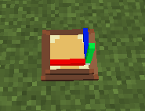
- **Description:**
  - Physical posture analyzer, which can obtain the current physical structure's posture through the CC peripheral.
- **CC Peripheral:**
  - ```lua
    local p = peripheral.find("spinalyzer")
    
    -- Get the rotation quaternion
    -- Return value: {x, y, z, w}
    local q = p.getQuaternion() 
    
    -- Get the rotation matrix
    -- Return value:
    {{m00, m01, m02},
      {m10, m11, m12},
      {m20, m21, m22}}
    local t = p.getTransform() 
    
    -- **Deprecated** Currently meaningless
    -- Get the relative rotation matrix
    -- Return value:
    {{m00, m01, m02},
      {m10, m11, m12},
      {m20, m21, m22}}
    local rt = p.getRelativeTransform()
    
    -- **Deprecated** Currently meaningless
    -- Get the relative rotation angle
    -- Parameter: axis, x:0, y:1, z:2
    -- Return value: double
    local ra = p.getRelativeAngle(1)
    
    -- Get the physical information of the physical structure
    -- 
    -- Return value: table
      {
       velocity = {x=vx, y=vy, z=vz},             -- Velocity
       omega = {x=wx, y=wy, z=wz},                -- Angular velocity
       position = {x=px, y=py, z=pz},             -- World coordinates of the center of mass
       quaternion = {x=qx, y=qy, z=qz, w=qw},     -- Rotation quaternion
       up = {x=ux, y=uy, z=uz}                    -- Direction of the block's UP in the world coordinate system
       mass = m                                   -- Mass
       id = id                                    -- ID of the physical structure
      },
    local sp = getPhysicsInfo()
    
    ```
- **Note:**
  - Unlike the CCVS API, the data obtained by the spinalyzer comes from the VS physical frame data. If the CC script does not run in the game tick but is synchronized with the physical tick, it can still obtain the correct data. In this case, if the CCVS API is used, the data obtained between two game ticks will be the same and cannot correctly reflect the movement of the physical structure.
  - For how to run CC in the physical tick, please refer to other chapters.

### Camera
- 
- **Description:**
  - Camera, currently just a small toy that changes the player's perspective. When used on a physical structure, it will change the player's perspective according to the rotation of the physical structure.
  - You can still control yourself while using the camera perspective.

### Servo Motor
- 
- **Description:**
  - Servo motor, with multiple control methods including manual adjustment, redstone, CC input, and speed input. It has a built-in adjustable PID controller with speed and angle control modes, driving the rotation of the physical structure.
- **Assembly:**
  - Similar to the clockwork physical bearing, place a block above the bearing surface and shift right-click the bearing with an empty hand to physicalize the block.
- **Connection:**
  - In addition to manually assembling a load physical structure, the Servo Motor can connect to other physical structures to make them a load.
  - 
    - Set the tool gun to Servo mode.
    - Right-click the Servo Motor with the tool gun to see a red frame, indicating the connection surface of the Servo Motor.
    - Right-click the block surface of another physical structure with the tool gun to see a yellow frame, indicating the block surface that will align with the red connection surface after connection.
    - Right-click the air to start the assembly process. The physical structure will automatically fly to the Servo Motor and try to align the two surfaces, then add constraints to complete the assembly.
    - Note:
      - If there are obstacles or external resistance on the connected part, it may not align completely. If the distance between the surfaces exceeds one block during the constraint attempt, the constraint will not be added.
      - You can manually bring the two surfaces closer using a gravity gun from another mod to complete the connection.
- **Locking:**
  - In the **default state**, applying a redstone signal greater than 7.5 will lock the load structure, preventing it from rotating.
- **Control Panel:**
  - 
  - Target: The target value. In angular velocity mode, it is the target angular velocity (rad/s). In angle mode, it is the target angle (rad). The input range in angle mode is -pi to pi.
  - Current: The current value. In angular velocity mode, it is the current servo angular velocity. In angle mode, it is the current servo angle.
  - P: The proportional coefficient of the PID controller. The higher the P, the faster the adjustment, but it may cause greater oscillation.
  - I: The integral coefficient of the PID controller, used to eliminate steady-state errors. It may cause oscillation or slow down the response speed.
  - D: The damping coefficient of the PID controller, used to reduce oscillation, but it may slow down the response speed.
  - Offset: The offset of the Servo Motor's connection surface relative to the physical structure during the next assembly or connection.
  - Mode switch button: Used to adjust toggle angular/speed mode of the Servo Motor.
- **Speed Input:**
  - In angular velocity mode, mechanical power rotation can be input through the bottom of the Servo Motor, making the rotation target value equal to the speed input value (-256 to 256).
- **Disassembly:**
  - Right-click the bearing with the tool gun in Destroy mode to disconnect.
- **Redstone Interface:**
  - 
  - Six domains can be selected as control quantities for the redstone signal:
    - Torque: Control the output torque with redstone, linearly varying between min and max based on the redstone signal strength.
    - Target: Control the target value with redstone, same as the Target meaning in the control panel, linearly varying between min and max based on the redstone signal strength.
    - P: Control the proportional coefficient of the PID controller with redstone, linearly varying between min and max based on the redstone signal strength.
    - I: Control the integral coefficient of the PID controller with redstone, linearly varying between min and max based on the redstone signal strength.
    - D: Control the damping coefficient of the PID controller with redstone, linearly varying between min and max based on the redstone signal strength.
    - Is Locked: Control whether the Servo Motor is locked with redstone.
- **PID Controller Output Torque:**
  - Assuming the error sequence of the current value and the target value sampled at the physical tick is e[k], the theoretical output torque at time k is:
    $$
    T[k] = (p * e[k] + i * clamp(\sum_{0}^{k}{e[j]}, MAX) + d*(e[k] - e[k - 1]) / ts) * inertia * scale ^ 5
    $$
  - Where:
    - ts is the time interval of the physical tick.
    - Clamp is the truncation function.
    - MAX is the maximum value of the integral term.
    - Inertia is the rotational inertia of the directly connected physical structure.
    - Scale is the scaling factor of the physical structure.
- **Servo Motor CC Peripheral:**
  - ```lua
    local p = peripheral.find("servo")
    
    p.setTargetAngle(1.57) -- Set the target angle/angular velocity
    local v = p.getTargetAngle() -- Get the target angle/angular velocity
    local a = p.getAngle() -- Get the current servo angle
    p.setOutputTorque(100)  -- Set the **additional** output torque, added to the PID controller's output
    p.setPID(1, 0.1, 0.1) -- Set the PID parameters, in the order of P, I, D
    p.setMode(true/false) -- Set whether it is in angle mode
    local m = p.getRelative() -- Get the rotation matrix of the load relative to itself
    
    -- Return value: {servomotor=sp1, companion=sp2},
    -- The definitions of sp1 and sp2 refer to the spinalyzer
    local sp = p.getPhysics() -- Get the physical frame physical information of itself and the load
    ```
- **Notes:**
  - Negative PID inputs may cause oscillation. You can set the negative input to absolute value in the config.
  - Since the PID control in the game is essentially discrete, a high D value will also cause oscillation. In angular velocity mode, it is recommended to set D to 0. In angle mode, it is recommended not to exceed 20.
  - Since the servo motor can only obtain the mass of the directly connected physical structure, when the load physical structure is connected to other physical structures through constraints, the control performance may decrease. You can increase the P and I values accordingly.
  - Do not use a wrench to change the orientation of the Servo Motor with a load, as it will not work properly. If you accidentally change it, it can still run normally after adjusting it back.
### Magnet
- 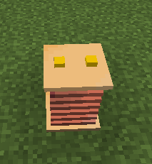
- **Description:**
  - Magnet, can set the strength, considered as a charge, the sign of the strength indicates the positive or negative charge strength.
- **Control Panel**
  - 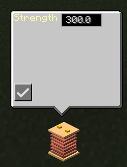
  - Strength: The strength of the magnet.
- **Attraction**
  - The attraction of the magnet is inversely proportional to the square of the distance and directly proportional to the strength, with a coefficient of 1, i.e., Coulomb's law.
- **Magnet Peripheral**
  - ```lua
    local p = peripheral.find("magnet")
    
    p.setStrength(-300)         -- set Magnet strength
    local v = p.getStrength()   -- get Magnet strength
    ```


### Joint Motor
- 
- **Description:**
  - Joint motor, almost identical to the Servo Motor except for the rotation direction, cannot adjust offset, and has no speed input. Refer to the Servo Motor section for details.
- **Orientation**
  - 
  - The Joint Motor can face 6 directions, and each direction can be set to parallel or perpendicular orientation using a wrench.
- **Connection**
  - 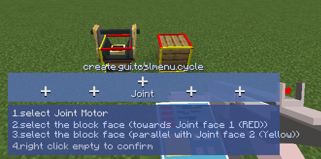
  - Use the tool gun to connect:
    - Set the tool gun to Joint mode.
    - Right-click the Joint Motor, two faces (red and yellow) will appear.
    - Right-click a face A of the block to be assembled, a red frame will appear at the clicked position.
    - Right-click another face B of the block, a yellow frame will appear.
    - Right-click the air to start the assembly.
    - Normally, after assembly, the faces indicated by the red frame will align, and the faces indicated by the yellow frame will point in the same direction.
  - Note:
    - Face B must be perpendicular to face A, otherwise it cannot be selected.
    - Face B can be on other blocks (even other ships, but this is meaningless), only as a direction indicator.

### Spherical Hinge
- 
- **Description:**
  - Spherical hinge, can connect two physical structures through a ball joint.
- **Height**
  - The height of the spherical hinge can be adjusted by right-clicking with a wrench. Note that adjusting the height of a connected hinge will not take effect immediately and requires reconnection.
- **Connection**
  - 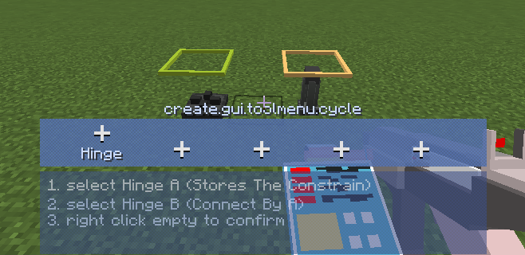
  - Use the tool gun to connect the hinge:
    - Set the tool gun to Hinge mode.
    - Right-click Spherical Hinge A, a green face will appear, indicating the connection face (constraint information will be saved).
    - Right-click Spherical Hinge B, a yellow face will appear, indicating the connection face.
    - Right-click the air, the constraint will be added directly.
- **Disconnect**
  - Use the tool gun in Destroy mode to right-click the hinge that saved the constraint information to disconnect.
- **Note**
  - Do not connect hinges too far apart, unless one is on the ground or static, as the impact force may cause problems.
  - The constraint information is saved in the **first selected** hinge. To disconnect using the tool gun in Destroy mode, you need to right-click this hinge.
  - In theory, multiple hinges can be connected at the same point, but you need to correctly select the hinge without saved constraint information each time. Otherwise, previous connections may be disconnected, so it is not recommended.


### Revolute Hinge
- 
- **Description:**
  - Revolute hinge, connects two physical structures through a revolute hinge.
- **Height**
  - Same content as the spherical hinge.
- **Connection**
  - 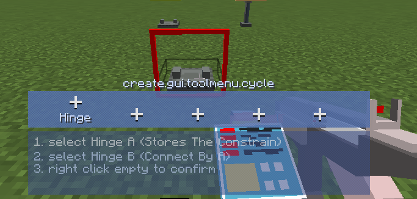
  - When holding the tool gun in Hinge mode or holding a wrench, a red frame will appear on the side of the revolute hinge block, representing the orientation.
  - Use the tool gun to connect, following the same steps as the spherical hinge.
  - Note:
    - 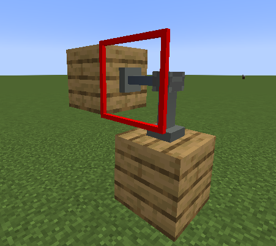
    - After connection, the red frame faces of the two revolute hinges will face the same direction.
- **Orientation**
  - Use a wrench and shift+right-click to change the orientation of the red face.

### Pivot Hinge
- 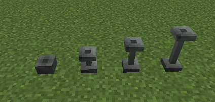
- **Description:**
  - 
  - Pivot hinge, connects two physical structures through a pivot hinge. Functions and usage are similar to the spherical hinge, but the rotation axis is vertical.

### Physical Piston
- 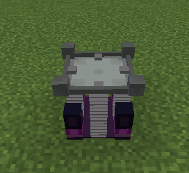
- **Description:**
  - A piston that can connect physical structures, considered as an adjustable stiffness and adjustable equilibrium position spring.
- **Assembly:**
  - Place a block on the top of the piston, shift+right-click the piston to assemble the block into a physical structure driven by the piston.
- **Connection:**
  - Use the tool gun to connect
    - 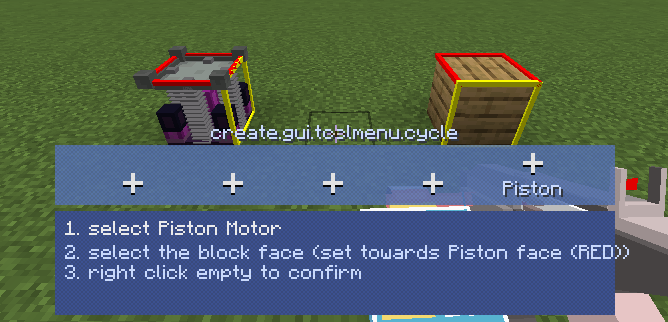
    - Right-click the piston, a red face and a yellow face will appear
    - Right-click the physical structure to be connected, a red frame (A) will appear on the clicked face
    - Right-click another part of the physical structure to be connected, a yellow frame (B) will appear on the clicked face
    - Right-click the air to start the connection
    - Normally, after the connection is completed, the red faces will align, and the yellow faces will point in the same direction
    - Note
      - If there are obstacles or external resistance on the connected part, it may not align completely. If the distance between the faces exceeds one block during the constraint attempt, the constraint will not be added
      - You can manually bring the two faces closer using a gravity gun from another mod to complete the connection
      - Face A and face B must be perpendicular to each other when selected, otherwise face B cannot be selected
      - Face B can be on other blocks (even other ships, but this is meaningless), only as a direction indicator
- **Control Panel**
  - 
  - Target: The target distance value, representing the target position of the controlled object relative to the piston, can be considered as the equilibrium position of the piston
  - Current: The current distance value, representing the actual position of the controlled object relative to the piston
  - P: The proportional coefficient of the PID controller. The higher the P, the faster the adjustment, but it may cause greater oscillation
  - I: The integral coefficient of the PID controller, used to eliminate steady-state errors. It may cause oscillation or slow down the response speed
  - D: The damping coefficient of the PID controller, used to reduce oscillation, but it may slow down the response speed
- **Redstone Interface**
  - 
  - Force: Indicates that the redstone signal will control the output force, linearly varying between min and max.
  - Target: Indicates that the redstone signal will control the target distance, linearly varying between min and max.
  - P, I, D: Same as above.
- **PID Controller Output Force**
  - Assuming the error sequence between the current value and the target value sampled at the physical tick is e[k], the theoretical output force at time k is:
    $$
    F[k] = (p * e[k] + i * clamp(\sum_{0}^{k}{e[j]}, MAX) + d*(e[k] - e[k - 1]) / ts) * mass * scale^3 +  mass * g * sin(\phi)
    $$
  - Note:
    - The piston will try to counteract the gravity component of the controlled object in the sliding direction, reflected as an additional gravity term in the above formula.
    - When the PID controller runs in the physical tick, g=10.
- **Limitations**
  - The maximum sliding distance is 32 blocks by default, which can be adjusted in the config. Excessive distances may cause instability.
  - When the piston is **on a physical structure** and tries to move **very heavy blocks and extend**, it may cause jittering.
- **Physics Piston CC Peripheral**
  - ```lua
      local p = peripheral.find("slider")

      p.setTargetDistance(12) -- Set the target distance
      local v = p.getDistance() -- Get the target distance
      p.setOutputForce(100)  -- Set the **additional** output force, added to the PID controller's output
      p.setPID(1, 0.1, 0.1) -- Set the PID parameters, in the order of P, I, D

      -- Return value: {slider=sp1, companion=sp2},
      -- The definitions of sp1 and sp2 refer to the spinalyzer
      local sp = p.getPhysics() -- Get the physical frame physical information of itself and the load
      ```
  ### Gravitational Anchor
- 
- **Description:**
  - A block used to apply air resistance and additional gravity (or counteract gravity) to the physical structure it is on.
- **Control Panel:**
  - 
  - Air Resistance: Air resistance coefficient
  - Extra Gravity: Additional g value
- **Force:**
  - Given the resistance coefficient \(\alpha\) and additional g value \(g'\), when the physical structure's speed is \(v\), the forces are:
  - Resistance: \(\alpha \times v \times \text{mass}\), direction opposite to \(v\), acting on the center of mass of the physical structure
  - Additional Gravity: \(g' \times \text{mass}\), acting downward

### Forget-Me-Not
- 
- **Description:**
  - Deletes the physical structure it is on 3 seconds after being activated by redstone.
  - Disabled by default, can be enabled in the config.

### Jet Engine & Jet Rudder
- 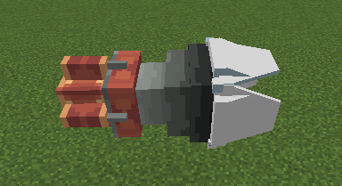
- **Description:**
  - Vector jet engine
- **Jet Engine Control Panel:**
  - 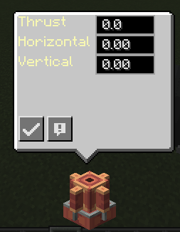
  - Thrust: Thrust magnitude
  - Horizontal: Horizontal gas rudder deflection angle, valid range -pi/2 to pi/2
  - Vertical: Vertical gas rudder deflection angle, valid range -pi/2 to pi/2
  - Note: After adjusting the angle, the gas rudder will have a deflection animation, but the maximum observed deflection is 45°
- **Jet Engine Redstone Interface:**
  - 
  - Thrust: When selected, the redstone signal will control the thrust magnitude, linearly varying between min and max.
  - Horizontal Tilt: When selected, the redstone signal will control the horizontal deflection angle, linearly varying between min and max.
  - Vertical Tilt: When selected, the redstone signal will control the vertical deflection angle, linearly varying between min and max.
- **Jet Engine CC Peripheral:**
  - ```lua
    p = peripheral.find("jet")
    p.setOutputThrust(100)    -- Set output thrust
    p.setHorizontalTilt(0.4)  -- Set horizontal deflection angle, in radians
    p.setVerticalTilt(0.4)    -- Set vertical deflection angle, in radians
    ```
### Spatial Anchor
- 
- **Description:**
  - A spatial anchor, an automatic alignment device that can align physical structures with dynamic mechanical structures or other physical structures.
- **States:**
  - The Anchor has 3 states:
    - Static: The Anchor can be the alignment target of other dynamic Anchors.
    - Dynamic: If the Anchor is on a physical structure, it will automatically search for the nearest static Anchor within range and try to control the physical structure to align the two Anchors.
    - Disabled: It will neither search for other Anchors nor become the target of other Anchors.
- **Alignment:**
  - When the Anchor starts to align, the physical structure it is on will automatically fly, adjusting to the target position and posture so that the dynamic and static Anchors can align.
  - During alignment, the faces of the two Anchors will face each other, and the bases will point in the same direction.
  - 
  - The static Anchor only serves as the target posture provider for the dynamic Anchor and will not be affected by reaction forces, even though the process may appear magnetic.
  - The dynamic Anchor will only search for other static Anchors in the same channel as its target.
  - When searching for a target, it can accept static Anchors up to 32 blocks away as targets, and the distance limit can be adjusted in the Config.
- **Control Panel:**
  - 
  - Offset: The distance between the two Anchors after alignment, only effective when adjusted by the dynamic Anchor.
  - Channel: The channel the Anchor is on.
  - Is Running: Controls whether the Anchor is in running state, red indicates disabled.
  - Is Static: Controls whether the Anchor is static, red indicates dynamic.
- **Redstone Interface:**
  - 
  - Offset: Same meaning as above.
  - Is Running, Is Static: When these control domains are selected, receiving a redstone signal greater than 7.5 will set the corresponding domain to true, otherwise false.
  - P, I, D: The PID parameters of the built-in flight control PID controller during alignment.
- **On Dynamic Structures:**
  - When an Anchor is on a dynamic structure of mechanical power, it defaults to a static enabled Anchor, which can be switched through the dynamic structure controller, and its channel will be retained.
  - 
- **Spatial Anchor CC Peripheral:**
  - ```lua
    p = peripheral.find("spatial")
    p.setStatic(true)    
    p.setRunning(true) 
    p.setOffset(4)   
    p.setPPID(p,i,d) -- Set the PID controller parameters when aligning position
    p.setQPID(p,i,d) -- Set the PID controller parameters when aligning rotation
    p.setChannel(0)
    ```

### Wireless Redstone Terminal
- 
- **Description:**
  - The wireless version of the redstone interface, with up to 6 wireless redstone channels. When attached to a machine with a redstone interface, it will receive the redstone signal of the corresponding channel and change the corresponding attribute value of the machine.
- **Control Panel:**
  - Using the Servo Motor as an example:
  - The left column is the channel frequency editing column, used in the same way as the mechanical power wireless redstone.
  - The right side shows the attributes of the machine (Servo Motor) that can be controlled by redstone, boolean attributes cannot change min and max.
  - The rightmost button is used to control whether the channel is enabled.
  - For the specific controllable attributes of each machine, please refer to their respective **Redstone Interface** sections.