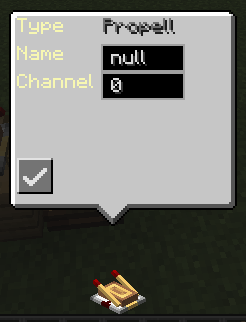

# Welcome To Control Craft Wiki
## Blocks:
### ChunkLoader:

- 

- **简述:** 
  - 放置于VS船上，自动地强加载周围区块的方块
- **详情:** 
  - 1.当且仅当位于VS物理结构上时会加载区块
  - 2.加载区域默认为5x5区块，可在Config文件中调整半径R，由于ChunkLoader本身位于一个区块内，因此实际区域为边长为(1+R)的区域
  - 3.如果VS物理结构被卸载，则ChunkLoader会失效

### Propeller Controller & Propeller：
- Propeller Controller：
- 
- Propeller：
- 
- 结合使用：
- 
- **简述:**
  - 将Propeller放置于Propeller Controller之上以发挥作用，其实际作用为一个带反扭矩的螺旋桨推进器
- **Propeller Controller 控制面板**
  - 
  - Speed: 输入转速以调整螺旋桨的转速，默认情况下没有限制
- **Propeller 控制面板**
  - 
  - T Ratio: 螺旋桨旋转时对物理结构的反扭矩系数
  - F Ratio：螺旋桨的升力系数
- **作用力：**
  - 方向：正转速，正扭矩系数，正作用力系数输入时，螺旋桨选择方向为顺时针，产生的反扭距使得物理结构往逆时针方向旋转，作用力方向朝上
  - 大小：转速乘以系数
- **Propeller Controller 红石接口**
  - 
  - Speed: 当接入红石信号时，使得转速在min max之间等间隔取值，0时取min，15时取max
- **Propeller Controller CC外设**
- ```lua
  local p = peripheral.find("PropellerController")
  local p = 100

  p.setTargetSpeed(speed) -- 设置目标转速
  local v = p.getTargetSpeed() -- 获取当前转速
  ```
  
### Peripheral Proxy & Peripheral Interface
- Peripheral Proxy 
- 
- Peripheral Interface
- 
- **简述:**
  - 将Proxy贴在CC电脑上，Interface贴在CC外设上，可以通过Proxy远程调用Interface所贴的外设
- **Peripheral Interface 控制面板：**

  - 未贴在外设上：
  - 
  - 贴在外设上，以Propeller Controller为例：
  - 

  - 面板第一行Type为该外设ID，Name初始为null，表示未命名，Channel默认为0

- **命名**
  - 命名不可为null，不可为空，位于同一channel下的所有外设的命名不可重复，
  - 如果尝试使用一个已占用的name，则无法命名，表现为Name值与上次一样
- **频道**
  - 在Proxy的外设方法中可设置Proxy的频道，通过Proxy只能调用同一频道下的Interface所接的远程外设
- **调用**
  - 举例：
  - 将Proxy贴在CC电脑上，Interface贴在Propeller Controller上，Interface命名为w1, 频道为0（默认）
  - ```lua
    local p = peripheral.find("transmitter")
    p.setProtocol(0) -- 由于是默认频道，此时可以没有这一行
    p.callRemote("w1", "setTargetSpeed", 100)
    local v = p.callRemote("w1", "getTargetSpeed") -- 100
    ```
  - callRemote中参数依次为：
    - Interface的名称
    - 目标方法名称
    - 目标方法参数，可以有多个
  - callRemote的返回值：
    - 取决于调用的方法
- **限制**
  - 只要Interface所贴的外设有效（其BlockEntity提供IPeripheral），即可通过上述方法远程调用，无距离限制
  - 其他mod中的CC外设也可以，比如Create转速控制器
- **Proxy CC外设**
  - ```lua
    local p = peripheral.find("transmitter")
  
    -- 设置频道
    p.setProtocol(0)
  
    -- 调用远程外设
    p.callRemote("name", "method_name", args...)

    -- 此方法没有返回值，无论被调用的方法是否有返回值
    -- 被调用的方法会在下一个**游戏tick**执行
    -- 特殊： 如果启用物理帧CC功能，在其他Mod实现中
    --       注解为@LuaFunction(mainThread = true)的外设方法，
    --       依旧会在物理刻中执行
    p.callRemoteAsync("name", "method_name", args...)
   
    ```
    
### Flap Bearing
- 
- **简述:**
  - 襟翼轴承，可以通过侧面滑条调整角度，通过CC外设调整角度，目前尚无法用红石调整角度，现在它被红石激活时角度会调整为1°（未完工）
- **组装**
  - 使用方法类似clockwork襟翼轴承，激活时空手右键顶面（没有滑条，且与动态结构相连的那一面）进行组装
- **CC外设**
  - ```lua
    local p = peripheral.find("WingController")
    p.setAngle(45) -- 设置角度
    local v = p.getAngle() -- 获取角度
    ```
- **注意**
  - 改变角度时，其flap动态结构只是看起来有个调整过程，但是其角度实际是立马设为目标角度的

### Spinalyzer
-
- **简述:**
  - 物理姿态分析仪，通过CC外设可以获取当前物理结构的物理姿态
- **CC外设**
  - ```lua
    local p = peripheral.find("spinalyzer")
    
    -- 获取旋转四元数
    -- 返回值：{x, y, z, w}
    local q = p.getQuaternion() 
    
    -- 获取旋转矩阵
    -- 返回值：
    {{m00, m01, m02},
      {m10, m11, m12},
      {m20, m21, m22}}
    local t = p.getTransform() 
    
    -- **Deprecated** 目前没有意义
    -- 获取相对旋转矩阵
    -- 返回值：
    {{m00, m01, m02},
      {m10, m11, m12},
      {m20, m21, m22}}
    local rt = p.getRelativeTransform()
    
    -- **Deprecated** 目前没有意义
    -- 获取相对旋转角度
    -- 参数：轴, x:0, y:1, z:2
    -- 返回值：double
    local ra = p.getRelativeAngle(1)
    
    -- 获取物理结构的物理信息
    -- 
    -- 返回值：table
      {
       velocity = {x=vx, y=vy, z=vz},             -- 速度
       omega = {x=wx, y=wy, z=wz},                -- 角速度
       position = {x=px, y=py, z=pz},             -- 重心的世界坐标
       quaternion = {x=qx, y=qy, z=qz, w=qw},     -- 旋转四元数
       up = {x=ux, y=uy, z=uz}                    -- 方块的UP方向对应的世界坐标系下的方向
       mass = m                                   -- 质量
       id = id                                    -- 物理结构的ID
      },
    local sp = getPhysicsInfo()
    
    ```
- **注意**
  - 与CCVS的api不同，spinalyzer获取的数据来自VS的物理帧数据，如果CC脚本并不运行在游戏刻，而是与物理刻同步的话，依然可以获取正确的数据，
    此时如果使用CCVS的api，则在两个游戏刻度间获取的数据是一样的，不能正确反映物理结构的运动
  - 关于如何在物理刻下运行CC，请参考其他章节

### Camera
-
- **简述:**
  - 相机，目前只是个改变玩家视角的小玩具，在物理结构上使用时会根据物理结构的旋转改变玩家视角
  - 使用相机视角时，你依然可以操控你自己

### Sevo Motor
- 
- **简述:**
  - 伺服电机，拥有手调，红石，CC输入，转速输入的多种控制方式，内置可调的PID控制器，调速，调角两种控制模式，带动物理结构旋转
- **组装**
  - 使用时类似clockwork物理轴承，在轴承面上方放置方块，空手右键轴承以将该方块物理化
- **连接**
  - 除了手动组装产生负载物理结构，Servo Motor可以连接其他物理结构使其成为负载
  - 
    - 将工具枪调至Servo模式 
    - 使用工具枪右键Servo Motor，可以看见红框，其表示Servo Motor的连接面
    - 使用工具枪右键其他物理结构的方块面，可以看见黄框，其表示连接后贴合红色连接面的方块面
    - 右键空气，组装过程开始，物理结构将会自动飞向Servo Motor并尝试自动对齐两个面，然后添加约束，完成组装
    - 注意
      - 如果由于阻碍或是被连接件存在外加阻力，则可能无法完全对准，如果尝试添加约束时
      面之间距离超过1格，则不会添加约束
      - 可以通过其他mod的重力枪手动将两个面靠近，使得连接能够完成
- **锁定**
  - **默认状态**下，通入大于7.5的红石信号，Servo Motor将会锁定负载结构，使其无法旋转
- **控制面板**
  - 
  - Target: 目标值，角速度模式时，为目标角速度(rad/s), 角度模式时，为目标角度(rad), 角度模式下输入范围为-pi - pi
  - current: 当前值，角速度时为当前伺服角速度，角度模式时为当前伺服角度
  - p: PID控制器的比例系数，p越高，调整越快，但是可能引起更大的震荡
  - i: PID控制器积分系数，用于消除稳态误差，可能引起震荡，或是减慢响应速度
  - d: PID控制器的阻尼系数，用于减小震荡，但是可能减慢响应速度
  - offset: 下一次组装或连接物理结构时，Servo Motor的连接面相对于物理结构的偏移量
  - 转换模式按钮: 用于调整Servo Motor的模式
- **转速输入**
  - 角速度模式下，通过Servo Motor的底部可以接入机械动力的旋转，使得旋转目标值等于转速输入值(-256 ~ 256)
- **拆卸**
  - 使用工具枪的Destory模式右键轴承，将会断开连接
- **红石接口**
  - 
  - 可以选择6个域作为红石信号的控制量
    - torque: 使用红石控制输出力矩, 根据红石信号强度在min, max间线性变化
    - Target: 使用红石控制目标值，和控制面板的Target含义相同, 根据红石信号强度在min, max间线性变化
    - p: 使用红石控制PID控制器的比例系数，根据红石信号强度在min, max间线性变化
    - i: 使用红石控制PID控制器的积分系数，根据红石信号强度在min, max间线性变化
    - d: 使用红石控制PID控制器的阻尼系数，根据红石信号强度在min, max间线性变化
    - is locked: 使用红石信号控制Servo Motor是否锁定
- **PID控制器的输出控制力矩**
  - 假设当前值与目标值的误差在物理刻采样得序列为e[k]，则k时刻输出力矩理论上为：
    $$
    T[k] = (p * e[k] + i * clamp(\sum_{0}^{k}{e[j]}, MAX) + d*(e[k] - e[k - 1]) / ts) * inertia * scale ^ 5
    $$
  - 其中
    - ts为物理刻的时间间隔
    - clamp为截断函数
    - MAX为积分项的最大值
    - inertia为所直接连接得物理结构转动惯量
    - scale为物理结构的缩放比例
- **Servo Motor的CC外设**
  - ```lua
    local p = peripheral.find("servo")
    
    p.setTargetAngle(1.57) -- 设置目标角度/角速度
    local v = p.getTargetAngle() -- 获取目标角度/角速度
    local a = p.getAngle() --获取当前的伺服角
    p.setOutputTorque(100)  --设置**额外**输出的力矩大小，加到PID控制器的输出上
    p.setPID(1, 0.1, 0.1) -- 设置PID参数，参数依此为P,I,D
    p.setMode(true/false) --设置是否为调角模式
    local m = p.getRelative() --获取负载相对自身的旋转矩阵
    
    -- 返回值：{servomotor=sp1, companion=sp2},
    -- sp1,sp2的定义参考spinalyzer
    local sp = p.getPhysics() --获取自身以及负载的物理帧物理信息
    ```
- **注意事项**
  - 负数的PID输入可能导致震荡，在config中可以设置将负数输入取绝对值
  - 由于游戏中的PID控制本质上是离散的，过高的d也会导致震荡，在角速度模式时，建议d设为0，在角度模式时，建议不要超过20
  - 由于servo motor只能获取直接连接的物理结构质量，当该负载物理结构通过约束连接其他物理结构时，可能会使得控制表现下降，可以酌情提高p值，i值
  - 请不要使用扳手改变带着负载的Servo Motor的朝向，这会使得它不能正常工作，如果不小心改变了，调整回去后依然可以正常运行


### Magnet
-
- **简述:**
  - 磁铁，可以设置强度，视作一个电荷，强度的符号即表示正负电荷强度
- **控制面板**
  - 
  - Strength: 磁铁的强度
- **吸引力**
  - 磁铁的吸引力与距离的平方成反比，与强度成正比，系数为1，即库仑力公式


### Joint Motor
-
- **简述:**
  - 关节电机，除了旋转方向不同，无法调节offset，没有转速输入外，与Servo Motor几乎一致，具体参考Servo Motor章节
- **朝向**
  - 
  - Joint Motor可以朝向6个面，在每个面上可以设置平行和垂直两种取向，使用扳手调节朝向
- **连接**
  - 
  - 使用工具枪进行连接
    - 工具枪调至Joint模式
    - 右键Joint Motor，出现红黄两个面
    - 右键需要组装的方块的某个面A，点击处出现一个红色框
    - 右键另一个方块面B，出现黄色框
    - 右键空气开始组装
    - 正常情况下，组装完成后红色框表示的面将会贴合，黄色框表示的面将指向相同
  - 注意：
    - 面B须与面A垂直，否则无法选择。
    - 面B可以位于其他方块上（甚至其他船，但这么做没有意义），仅仅作为方向指示


### Spherical Hinge
-
- **简述:**
  - 球形铰链，可以使得两个物理结构通过球铰链相连
- **高度**
  - 通过扳手右键可以调整球铰链的高度，注意对已连接的铰链调整高度不能立刻生效，需要重新连接
- **连接**
  - 
  - 使用工具枪连接铰链
    - 工具枪调至Hinge模式
    - 右键球铰链A，出现绿色面，表示连接面（将会保存约束信息）
    - 右键球铰链B，出现黄色面，表示连接面
    - 右键空气，约束将直接添加
- **断开连接**
  - 使用工具枪的Destory模式右键保存了约束信息的可以断开连接
- **注意**
  - 不要间隔太远连接铰链，除非其中一个在底面上或为static，否则冲击力可能造成麻烦
  - 约束的信息保存在**第一个被选择**的铰链中，使用工具枪的Destory模式时需要右键该铰链才能断开连接
  - 理论上可以将多个铰链连接在同一点，但是需要正确选择每次连接的铰链为**没有保存约束信息**的铰链，否则可能之前的连接会断开，因此并不建议这么做

### Revolute Hinge
- 
- **简述**
  - 柱铰链，使两个物理结构通过柱铰链相连
- **高度**
  - 内容与球铰链相同
- **连接** 
  - 
  - 手持工具枪调至Hinge模式，或手持扳手时，可以看见柱铰链方块侧面出现红色框，该框代表朝向
  - 使用工具枪进行连接，步骤和球铰链相同
  - 注意：
    - 
    - 连接完成后，两个柱铰链的红色框面将会面向同一方向
- **朝向**
  - 使用扳手shift+右键可以改变红色面的朝向

### Pivot Hinge
- 
- **简述**
  - 
  - 扭转铰链，使得两个物理结构通过扭转铰链相连，功能和使用方式类似球铰链，只不过旋转轴为垂直向上
  

### Physical Piston
- 
- **简述**
  - 可以连接物理结构的活塞，可以视为一个可调刚度，可调平衡位置的弹簧
- **组装**
  - 在活塞顶端放置方块，shift+右键活塞可以将该方块组装成物理结构并由活塞带动
- **连接**
  - 使用工具枪进行连接
    - 
    - 右键活塞，出现红色面，黄色面
    - 右键待连接的物理结构，点击面出现红框（A）
    - 右键待连接的物理结构的另一处，点击面出现黄框（B）
    - 右键空气开始连接
    - 正常情况下，连接完成后红色面将贴合，黄色面将指向同一方向
    - 注意
      - 如果由于阻碍或是被连接件存在外加阻力，则可能无法完全对准，如果尝试添加约束时
        面之间距离超过1格，则不会添加约束
      - 可以通过其他mod的重力枪手动将两个面靠近，使得连接能够完成
      - 面A和面B在选择时须相互垂直，否则将无法选择面B
      - 面B可以位于其他方块上（甚至其他船，但这么做没有意义），仅仅作为方向指示
- **控制面板**
  - 
  - Target: 目标距离值，表示被控件相对活塞的目标位置，可以视为活塞的平衡位置
  - current: 当前距离值，表示被控件相对活塞的实际位置
  - p: PID控制器的比例系数，p越高，调整越快，但是可能引起更大的震荡
  - i: PID控制器积分系数，用于消除稳态误差，可能引起震荡，或是减慢响应速度
  - d: PID控制器的阻尼系数，用于减小震荡，但是可能减慢响应速度 
- **红石接口**
  - 
  - Force:表示红石信号将控制输出力，使得其在min,max之间线性变化
  - Target:表示红石信号将控制目标距离，使得其在min,max之间线性变化
  - P,I,D:同上
- **PID控制器的输出力**
  - 假设当前值与目标值的误差在物理刻采样得序列为e[k]，则k时刻输出力理论上为：
    $$
    F[k] = (p * e[k] + i * clamp(\sum_{0}^{k}{e[j]}, MAX) + d*(e[k] - e[k - 1]) / ts) * mass * scale^3 +  mass * g * sin(\phi)
    $$
  - 注意：
    - 活塞会尝试抵消被控件的重力在滑动方向上的分量，体现为上式的额外重力项
    - PID控制器在物理刻中运行时，g=10
- **限制**
  - 滑动最大距离默认为32格，可以在config中调整，过大的距离可能有不稳定性
  - 当活塞**位于物理结构**上并尝试带动**很重的方块并伸长**时，可能出现鬼畜现象
- **Physics Piston的CC外设**
  - - ```lua
      local p = peripheral.find("slider")

      p.setTargetDistance(12) -- 设置目标距离
      local v = p.getDistance() -- 获取目标距离
      p.setOutputForce(100)  --设置**额外**输出的力的大小，加到PID控制器的输出上
      p.setPID(1, 0.1, 0.1) -- 设置PID参数，参数依次为P,I,D

      -- 返回值：{slider=sp1, companion=sp2},
      -- sp1,sp2的定义参考spinalyzer
      local sp = p.getPhysics() --获取自身以及负载的物理帧物理信息
      ```
      
### Gravitational Anchor
- 
- **简述**
  - 用于对所在物理结构施加空气阻力，额外重力（或抵消重力）的方块
- **控制面板**
  - 
  - Air Resistance: 空气阻力系数
  - Extra Gravity: 附加g值
- **作用力**
  - 设阻力系数为\alpha, 附加g值为g'当所在物理结构速度为v时，作用力为
  - 阻力: \alpha * v * mass ，方向与v相反，作用于物理结构质心
  - 额外重力: g' * mass, 作用方向朝下

### Forget-Me-Not（勿忘我）
-
- **简述**
  - 红石激活后3秒将会删除所在的物理结构
  - 默认不启用，可以在config中开启


### Jet Engine & Jet Rudder
- 
- **简述**
  - 矢量喷气发动机
- **Jet Engine的控制面板**
  - 
  - Thrust:推力大小
  - Horizontal:水平方向上的燃气舵偏转角度，有效范围-pi/2 ~ pi/2
  - Vertical:垂直方向上的燃气舵偏转角度，有效范围-pi/2 ~ pi/2
  - 注意：调整角度后燃气舵会有偏转动画，但是动画上观察最多偏转45°
- **Jet Engine的红石接口**
  - 
  - Thrust:选定后红石信号将控制Thrust大小在min,max间线性变化
  - Horizontal Tilt:选定后红石信号将控制水平偏转角度大小在min,max间线性变化
  - Vertical Tilt:选定后红石信号将控制垂直偏转角度大小在min,max间线性变化
- **Jet Engine的CC外设**
  - ```lua
    p = peripheral.find("jet")
    p.setOutputThrust(100)    --设置输出推力
    p.setHorizontalTilt(0.4)  --输入水平偏转角度，单位为rad
    p.setVerticalTilt(0.4)    --输入垂直偏转角度，单位为rad
    ```
    

### Spatial Anchor
- 
- **简述**
  - 空间锚，一种自动对齐装置，可以使物理结构与机械动力动态结构，或是其他物理结构对齐
- **状态**
  - Anchor有3种状态:
    - 静态: Anchor可以成为其他动态Anchor的对齐目标
    - 动态: 若此时Anchor位于物理结构，则会自动寻找范围内最近的静态Anchor，尝试控制所在物理结构使得两个Anchor能够对齐
    - 停用：既不会寻找其他Anchor，也不会成为其他Anchor的目标
- **对齐**
  - 当Anchor开始尝试对齐时，所在物理结构会自动飞行，调整至目标位置，姿态，使得动态和静态的Anchor能够对齐
  - 对齐时，两个Anchor的面将相对，底座指向相同方向
  - 
  - 静态Anchor只是作为动态Anchor的目标姿态的提供者，它并不会受到反作用力，即便这个过程表现得像磁铁
  - 动态Anchor只会寻找相同Channel下的其他静态Anchor作为自己的目标
  - 寻找目标时最远可以接受32格外的静态Anchor作为目标，可以在Config中调整距离限制
- **控制面板**
  - 
  - Offset:对齐后两个Anchor间相距的距离，只有动态Anchor调整这个值有效果
  - Channel:该Anchor所在频道
  - Is Running: 控制该Anchor是否是运行状态，红色为停用状态
  - Is Static: 控制该Anchor是否是静态得，红色为动态
- **红石接口**
  - 
  - offset:含义与上文相同
  - is_running, is_static: 调整控制域为这两个时，接收到大于7.5的红石信号后将会使得对应域为true，否则为false
  - P,I,D:对齐时飞控的内置PID控制器的pid参数值
- **位于动态结构**
  - 当一个Anchor位于机械动力的动态结构上时，其默认为一个静态的启用Anchor，可以通过动态结构控制器开关，其频道会保留
  - 
- **Spatial Anchor的CC外设**
  - ```lua
    p = peripheral.find("spatial")
    p.setStatic(true)    
    p.setRunning(true) 
    p.setOffset(4)   
    p.setPPID(p,i,d) -- 设置对齐位置时PID控制器的参数
    p.setQPID(p,i,d) -- 设置对齐旋转时的PID控制器参数
    p.setChannel(0)
    ```
    
### Wireless Redstone Terminal
- 
- **简述**
  - 红石接口的无线版本，拥有至多6个无线红石频道，贴在拥有红石接口的机器上时，将会接受对应频道的红石信号，改变该频道该机器的对应属性值
- **控制面板**
  - 以贴在Servo Motor为例：
  - 左侧栏为频道频率编辑栏，使用方式与机械动力无线红石相同
  - 右侧为该机械(Servo Motor)提供的可供红石控制的属性，布尔值属性无法更改min max
  - 最右侧按钮用于控制该频道是否开启
  - 具体到每一个机械有哪些可控属性，请参考各自的**红石接口**栏目